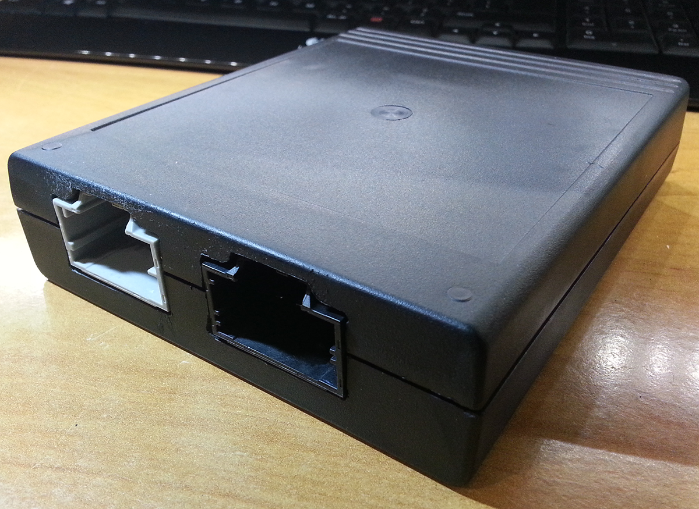
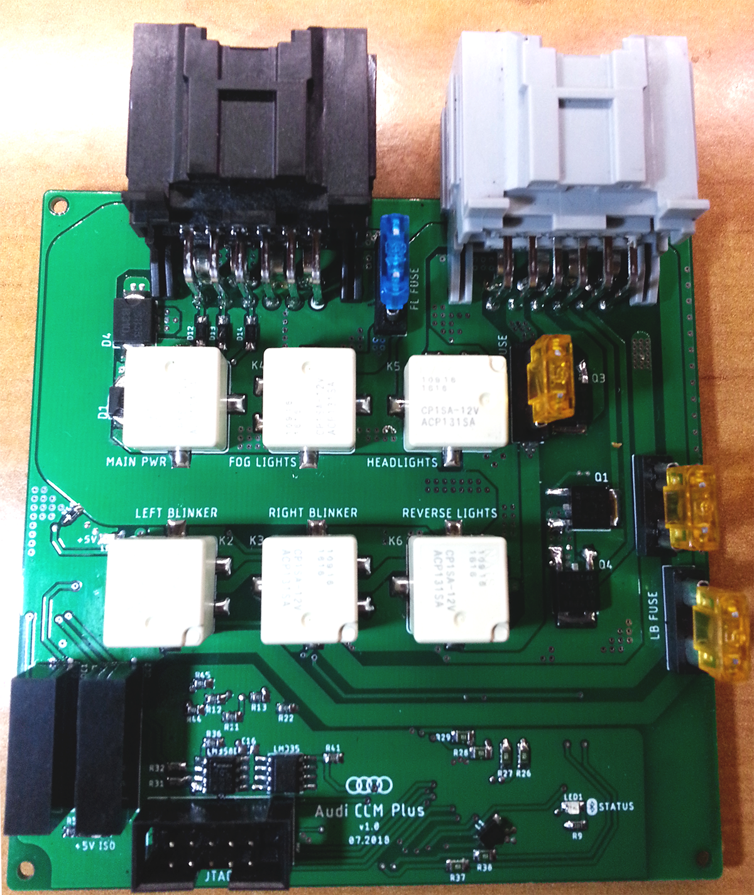
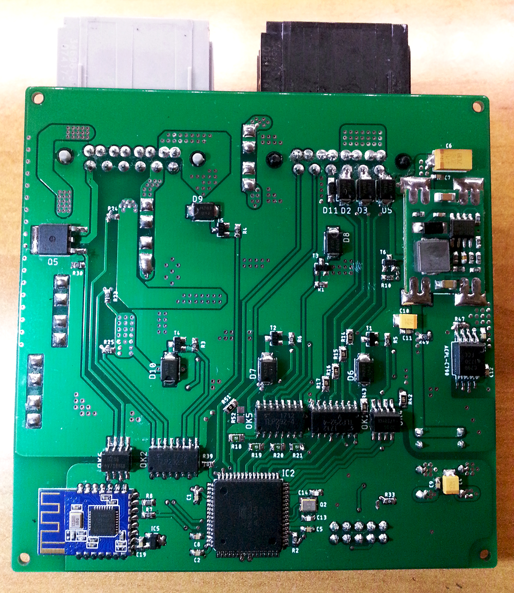
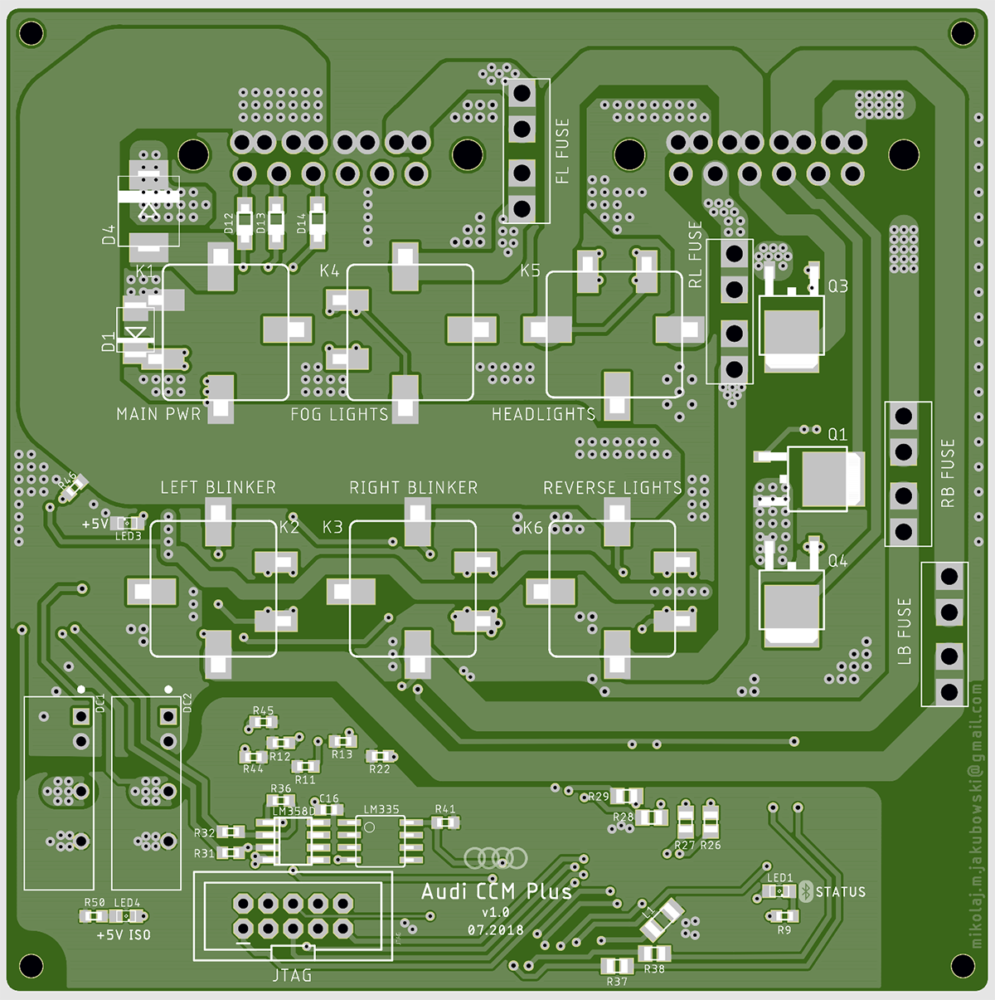
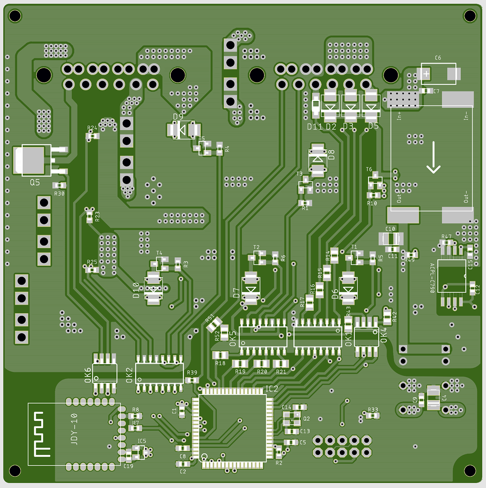
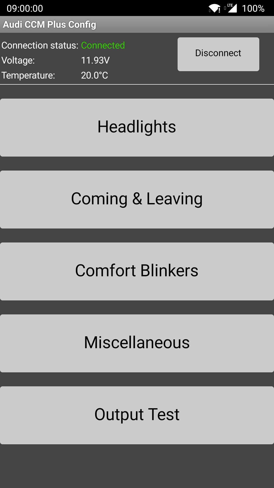

# Audi CCM Plus - samochodowy moduł komfortu

## Cechy:
* w pełni odizolowana galwanicznie część logiczna
* pomiar napięcia akumulatora/ładowania
* automatyczne włączenie świateł mijania po odpaleniu silnika
* czujnik natężenia światła do rozpoznawania dnia/nocy
* regulacja jasności diod power LED umieszczonych w lusterkach bocznych
* funkcja coming/leaving home, umożliwiająca oświetlenie przestrzeni wokół samochodu z użyciem dowolnej konfiguracji dostępnych źródeł światła, osobno dla coming i leaving:
	* światła przeciwmgłowe przednie
	* światła cofania
	* kierunkowskazy w trybie ciągłym
	* diody LED w lusterkach bocznych

* funkcja komfortowych kierunkowskazów, polegająca na wykonaniu zadanej liczby mignięć po lekkim dotknięciu manetki
* nauka fabrycznej częstotliwości migania kierunkowskazów w celu jej odtworzenia
* składanie lusterek po dwukrotnym naciśnięciu przycisku zamykania oraz automatyczne rozkładanie po otwarciu samochodu
* moduł bluetooth low energy do bezprzewodowej konfiguracji
* aplikacja mobilna na system Android
* zabezpieczenie przed uruchomieniem coming/leaving gdy napięcie akumulatora spadnie poniżej bezpiecznego poziomu lub gdy temperatura zewnętrzna wskazuje na możliwe obniżenie jego sprawności
* zabezpieczenie przed rozłożeniem lusterek bocznych, gdy temperatura zewnętrzna wskazuje na możliwe oblodzenie
* całkowite odcięcie zasilania po minucie bezczynności, zapewniające zerowy pobór prądu przez urządzenie podczas postoju
* brak ingerencji w fabryczną instalację elektryczną, po odpięciu modułu całe wyposażenie standardowe pojazdu działa w niezmieniony sposób
* obwody sterujące światłami zabezpieczone przeciążeniowo
---

